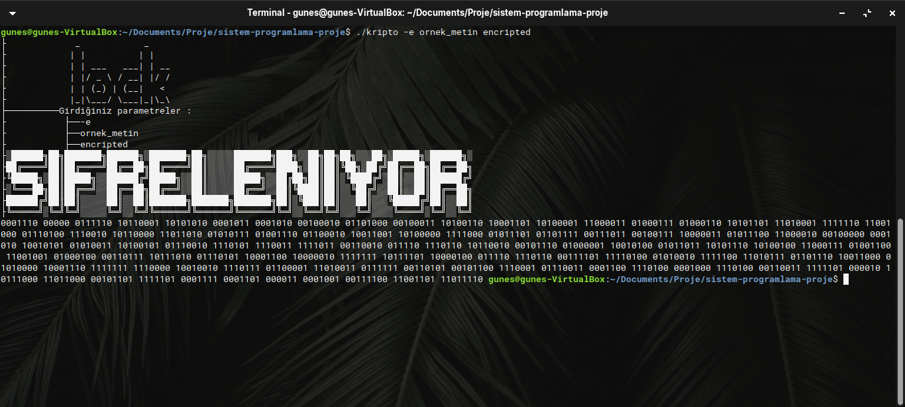
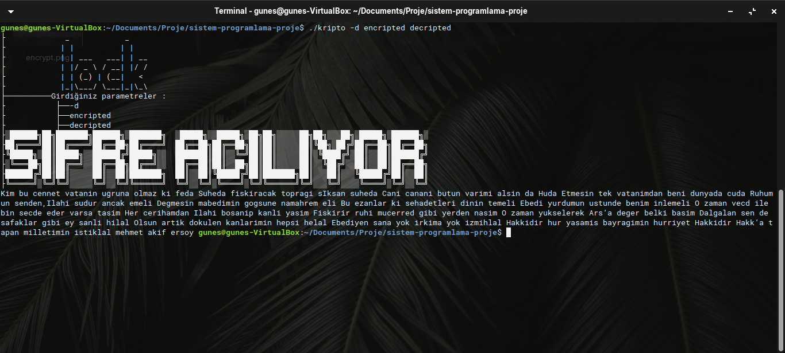

# 2020-2021 BAHAR DÖNEMİ SAKARYA ÜNİVERSİTESİ BSM308 SİSTEM PROGRAMLAMA PROJE ÖDEVİ
&nbsp;&nbsp;&nbsp;&nbsp;Bu repo, aşağıdaki tabloda bilgileri verilen öğrencilerin BSM308 Sistem Programlama dersi proje ödevini içermektedir. 
|Öğrenci Numarası|Ad Soyad|Ders Grubu|Öğretim Türü|Unvan|Kullanıcı Adı|
|-|-|-|-|-|-|
|B181210059|Nur Şevval YILDIZ|A|1. Öğretim|Deployment Sorumlusu|[sevvallyildizzz](https://github.com/sevvallyildizzz)|
|B181210098|Canan EROĞLU|B|1. Öğretim|Json Deserialization Sorumlusu|[cananEroglu312](https://github.com/cananEroglu312)|
|U101210016|Uğur ÜNVERMİŞ|B|2. Öğretim|Encode Ve Decode Sorumlusu|[ugurunvermis](https://github.com/ugurunvermis)|
|G181210068|Oğuzhan GÜNEŞ|C|2. Öğretim|Proje Yöneticisi|[gunesdev](https://github.com/gunesdev)|

## Öğrencilere Düşen Görevler
- Proje Yöneticisi (Oğuzhan GÜNEŞ)
	- GitHub’da projenin oluşturulması
	- Grup proje toplantıları ve bunların raporlanması
	- Proje raporlarının takip edilip iletilmesi
- Deployment Sorumlusu (Nur Şevval YILDIZ)
	- Makefile ve argümanların yazılması
	- Konsol arayüzünün yazılması
	- Programlama standartlarının ve kod düzeninin takip edilmesi
- Json Deserialization Sorumlusu (Canan EROĞLU)
	- Json formatındaki dosyanın ayrıştırılması
	- Ayrıştırılan verilerin bir veri yapısında tutulması
- Encode Ve Decode Sorumlusu (Uğur ÜNVERMİŞ)
	- Encode işlemlerinin gerçekleştirilmesi
	- Decode işlemlerinin gerçekleştirilmesi

## Projeden Görüntüler:
 
 

## Notlar:
1. libfdr kütüphanesindeki header dosyaları projede libfdr klasörü içinde bulunmalıdır.
2. libfdr kütüphanesinin obje dosyalarını içeren libfdr.a arşivi projede libfdr klasörü içinde bulunmalıdır.  
&nbsp;&nbsp;&nbsp;&nbsp;Bu şartlar sağlanmadığında makefile dosyası yeni senaryoya uygun biçimde düzenlenmelidir. Aksi takdirde proje derlenmeyecektir.